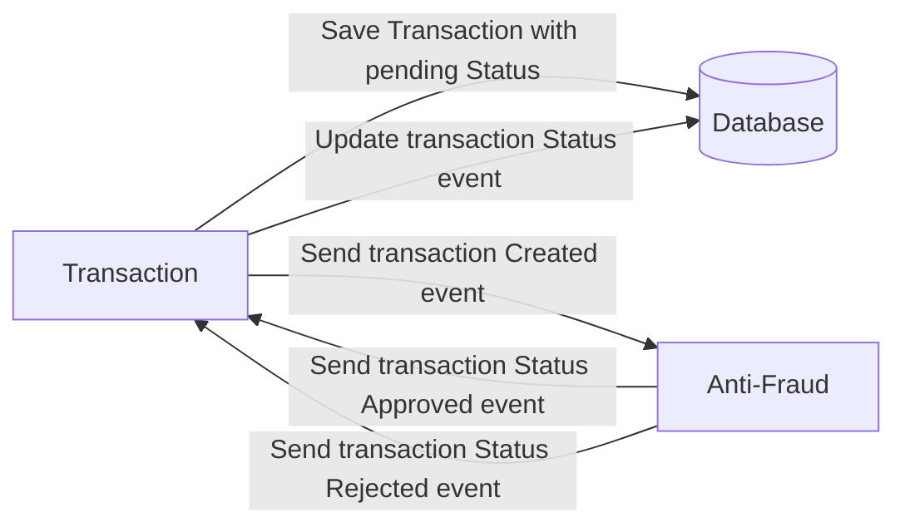

# Yape Code Challenge :rocket:

# Problem

Every time a financial transaction is created it must be validated by our anti-fraud microservice and then the same service sends a message back to update the transaction status.
For now, we have only three transaction statuses:

<ol>
  <li>pending</li>
  <li>approved</li>
  <li>rejected</li>  
</ol>

Every transaction with a value greater than 1000 should be rejected.



# Solution
* To solve this problem, 2 microservices were created:
  * AntiFraudManager microservice
  * TransactionManager microservice
* The microservices are implemented using reactive programing to ensure asynchronicity and improve their performance.
* Additionally, the used technologies allow an horizonal scalation to increase performance.

## Tech stack
* Java 21
* Spring Boot 3.5.9
* Spring Web Flux 
* Postgres 18
* Kafka 
* Redis 8.4
* Cassandra (Additional for possible high volume read/write scenarios)

### Main dependencies
* spring-boot-starter (3.5.9)
* spring-boot-starter-webflux (3.5.9)
* spring-kafka (3.3.11)
* lz4-java (1.10.2)
* reactor-kafka (1.3.25)
* spring-boot-starter-data-r2dbc (3.5.9)
* r2dbc-postgresql (1.1.1.RELEASE)
* spring-boot-starter-data-redis-reactive (3.5.9)
* spring-boot-starter-data-cassandra (3.5.9)

# Microservices
## TransactionManager
* Allows creating transactions
### Endpoints

#### [POST] /transaction
* Creates a transaction
```
[POST] /transaction (Request)
{
  "sourceAccountId": "{UUID}",
  "destinationAccountId":"{UUID}",
  "amount": {decimal-number}
}
```
```
[POST] /transaction (Response)
{
  "message": "Transaction created successfully",
  "transactionId": "{UUID}"
}
```

#### [GET] /transaction/{transactionId}
* Returns the details from a transaction
```
[GET] /transaction/{transactionId} (Response)
{
  "id": "{UUID}",
  "sourceAccountId": "{UUID}",
  "destinationAccountId": "{UUID}",
  "status": "REJECTED" | "PENDING" | "APPROVED",
  "type": "DEPOSIT",
  "amount": {decimal-number},
  "createdAt": {time-in-millis}
}
```

#### [GET] /transaction/account/{transactionId}
* Retrieves the transactions for a given account
  * _**Additional endpoint to validate Cassandra usage**_
```
[GET] /transaction/account/{transactionId} (Response)
[
  {
    "id": "{UUID}",
    "sourceAccountId": "{UUID}",
    "destinationAccountId": "{UUID}",
    "status": "REJECTED" | "PENDING" | "APPROVED",
    "type": "DEPOSIT",
    "amount": {decimal-number},
    "createdAt": {time-in-millis}
  },
  ...
]
```

### Flow
#### Create a Transaction
* A transaction is created using the endpoint `[POST] /transaction`
* The transaction, with `PENDING` status, is persisted into the `transaction` table in the PostgreSQL database
* A transaction entry is stored in Redis (to improve performance when retrieving transaction details)
* The transaction is also stored into the `transaction_by_account` table in the Cassandra database
  * Using the field `sourceAccountId` as the partition key and the fields `createdAt` and `id` for the clustering columns
* A `transaction event` is sent to Kafka topic `event`
  * The `transaction event` have the following fields:
    * transactionId (String)
    * amount (float)

#### Consume response events
* A Kafka consumer is subscribed to the Kafka topic `event-response`
  * The AntiFraudManager microservice publishes the transaction event response validations into this topic
  * The `transaction event response` have the following fields:
    * transactionId (String)
    * isValid (Boolean)
* Once a `transaction event response` is consumed,the `transaction` will be updated according to the `isValid` value:
  * `APPROVED` if `true`
  * `REJECTED` if `false`
* The transaction will be updated in: 
  * The `transaction` table in PostgreSQL database
  * The entry in Redis
  * The `transaction_by_account` table in the Cassandra database

#### Get transaction details
* The transaction details are requested using the endpoint `[POST] /transaction/{transactionId}`
* If the transaction is available in Redis, it will be retrieved. Otherwise, it will be retrieved from the database.

#### Get transaction details by account
* The transactions by a given account are requested using the endpoint `[POST] /transaction/account/{accountId}` 
* They will be retrieved from the required partition based on the `accountId` value from the Cassandra database.
  * The table `transaction_by_account` was build specifically for this query.

## AntiFraud
### Flow
#### Consume events
* A Kafka consumer is subscribed to the Kafka topic `event`
* Once the transaction event is consumed from Kafka, the `amount` field will be validated to set the response field `isValid`.
  * If the amount is lower or equal than 1000 it will be `true` otherwise it will be `false` 
* A `transaction event response` is sent to Kafka topic `event-response`
    * The `transaction event response` have the following fields:
        * transactionId (String)
        * isValid (Boolean)

# Build and run
## Requirements
* Install Docker for your current OS (https://www.docker.com/get-started/)
## Build Steps
* Clone the repository and set into the `yape-challenge` directory
* Set the following environment variables (credentials for the database):
  * POSTGRES_DB_NAME
  * POSTGRES_USER
  * POSTGRES_PASSWORD
```
export POSTGRES_DB_NAME={db-name}
export POSTGRES_DB_USER={db-user}
export POSTGRES_DB_PASSWORD={db-password}
```
* In the `/yape-challenge/Dockerfile.transaction` file update the following values:
```
ENV POSTGRES_USER={db-user}
ENV POSTGRES_PASSWORD={db-password}
ENV POSTGRES_DB_NAME={db-name}
```
* Execute the docker command `docker compose up -d`
* Wait until all the Docker containers are running
```
~/yape-challenge$ docker compose up -d
WARN[0000] No services to build                         
[+] up 8/8
 ✔ Container cassandra          Healthy                                                                                                                                                  0.6s 
 ✔ Container postgres           Running                                                                                                                                                  0.0s 
 ✔ Container redis              Running                                                                                                                                                  0.0s 
 ✔ Container zookeeper          Running                                                                                                                                                  0.0s 
 ✔ Container kafka              Running                                                                                                                                                  0.0s 
 ✔ Container transaction        Running                                                                                                                                                  0.0s 
 ✔ Container antifraud          Running                                                                                                                                                  0.0s 
 ✔ Container cassandra-baseline Exited 
```
## Usage
* The TransactionManager endpoints will be available in the `localhost:8082` host  
* You can manually validate the microservices endpoints using Postman
* Here are some examples:
```
[POST] http://localhost:8082/transaction (Request)
{
  "sourceAccountId": "8fcb1a7d-bc3a-4cf1-9077-e1eed948ac93",
  "destinationAccountId":"8fcb1a7d-bc3a-4cf1-9077-e1eed948ac93",
  "amount":11110.50
}

[POST] http://localhost:8082/transaction (Response)
{
  "message": "Transaction created successfully",
  "transactionId": "76e3f045-674a-466a-800a-28722bd0d13b"
}
```

```
[GET] http://localhost:8082/transaction/76e3f045-674a-466a-800a-28722bd0d13b (Response)
{
  "id": "76e3f045-674a-466a-800a-28722bd0d13b",
  "sourceAccountId": "8fcb1a7d-bc3a-4cf1-9077-e1eed948ac93",
  "destinationAccountId": "8fcb1a7d-bc3a-4cf1-9077-e1eed948ac93",
  "status": "REJECTED",
  "type": "DEPOSIT",
  "amount": 11110.5,
  "createdAt": 1768181711540
}
```

# Future improvements
* Use Spring Cloud Gateway (https://spring.io/projects/spring-cloud-gateway) with the Eureka discovery client (https://docs.spring.io/spring-cloud-netflix/docs/current/reference/html/) to build a load balancer so multiple instances of the microservices can be initiated.
* Define specific queries that will require huge amount of writes or reads so the required tables can be designed in Cassandra.
